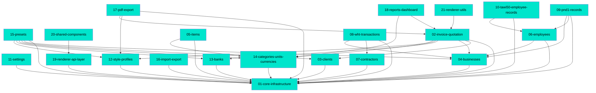

# MDD Connections

## Path Tree

```
App/
  ├── Import Export         16-import-export          complete
  ├── Settings              11-settings               complete
  └── Style Profiles        12-style-profiles         complete

Catalog/
  ├── Banks                 13-banks                  complete
  ├── Items                 05-items                  complete
  ├── Presets               15-presets                complete
  └── Reference Data        14-categories-units-currencies  complete

Contacts/
  ├── Businesses            04-businesses             complete
  ├── Clients               03-clients                complete
  ├── Contractors           07-contractors            complete
  └── Employees             06-employees              complete

Core/
  └── Infrastructure        01-core-infrastructure    complete

Export/
  └── PDF                   17-pdf-export             complete

Core/
  ├── Infrastructure        01-core-infrastructure    complete  (also listed above)
  ├── Renderer API          19-renderer-api-layer     complete
  ├── Shared Components     20-shared-components      complete
  └── Renderer Utils        21-renderer-utils         complete

Reports/
  └── Dashboard             18-reports-dashboard      complete

Invoices/
  └── Core                  02-invoice-quotation      complete

Meta/
  └── Schema                00-frontmatter-spec       complete

Tax/
  ├── PND1                  09-pnd1-records           complete
  ├── TAWI50                10-tawi50-employee-records complete
  └── WHT Transactions      08-wht-transactions       complete
```

## Dependency Graph



## Source File Overlap

(no files referenced by 2+ docs)

## Warnings

(none)
